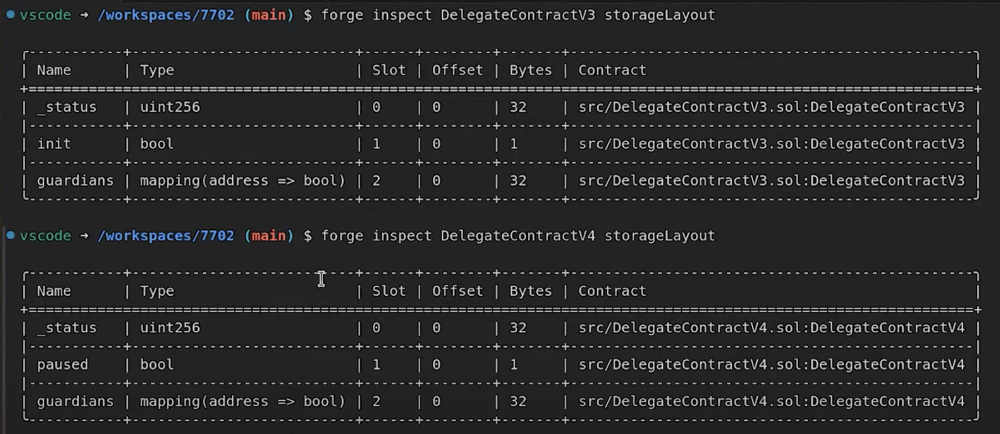

# Advanced EIP-7702: Insecure Delegation Patterns in Practice

## 1. Unprotected execute() calls drain delegated accounts
#### `DelegateContractV0`
#### code snippet:
```solidity
contract DelegateContractV0 {
    struct Call { address to; uint256 value; bytes data; }
    function execute(Call[] memory calls) external payable {
        for (...) {
            (bool success,) = call.to.call{value: call.value}(call.data);
            require(success);
        }
    }
}
```
### Test Breakdown:
#### 1. test_anyoneCanCall
```solidity
DelegateContractV0(alice.addr).execute(calls);
```
- Verifies that anyone can call execute() on Alice’s address after delegation.
- Simulates a full asset drain by transferring Alice’s ETH to Bob.
#### 2. test_cannotReceiveETH
```solidity
payable(alice.addr).transfer(1 ether); // reverts
```
- Checks that after delegation, Alice’s account cannot receive ETH due to missing receive() function.

## 2. The Illusion of Guardians
#### `DelegateContractV1`
#### code snippet:
```solidity
constructor(address[] memory newGuardians) {
  for (uint256 i = 0; i < newGuardians.length; i++) {
    address newGuardian = newGuardians[i];
    guardians[newGuardian] = true;
    emit NewGuardian(newGuardian);
    }
  }
```
At first glance, this constructor appears to give each account that delegates to this contract the ability to define their own list of guardians.
But that’s an illusion. In EIP-7702’s delegation model, this constructor is never executed during delegation.

- The constructor only runs once—at deployment of the delegate contract.
- Any EOA (externally owned account) that delegates to this contract via SetCode:
  - inherits the contract logic
  - but does not inherit any state initialized in the constructor, including guardians.

### Test Breakdown:
```solidity
DelegateContractV1(payable(alice.addr)).guardians(guardian_1) // returns false
```
Even though the contract was deployed with guardian_1 and guardian_2,
EOAs like alice or bob who attach this contract do not gain any of those guardian mappings.

## 3.  Anyone Can Initialize: Insecure Setup of Delegated Contracts
#### `DelegateContractV2`
#### code snippet:
```solidity
function initialize(address[] memory newGuardians) external { // can be called by anyone
  require(!init, AlreadyInitialized());
  for (uint256 i = 0; i < newGuardians.length; i++) {
    address newGuardian = newGuardians[i];
    guardians[newGuardian] = true;
    emit NewGuardian(newGuardian);
  }
  // not setting `init` to true
}
```
This contract attempts to fix the constructor issue from V1 by introducing an initialize() function for setting guardians after deployment. However, it introduces a new vulnerability:
- initialize() is public and can be called by anyone
- It fails to set init = true after initialization
- As a result, anyone can repeatedly call initialize(), overriding the guardians list
- This allows a third party to take control of accounts that delegate to this contract

### Test Breakdown:
#### test_anyoneCanInitialize
1. Alice delegates this logic to her EOA
2. Bob calls initialize() on Alice’s EOA, setting himself as guardian
3. Bob then drains Alice’s balance using executeGuardian()

## 4. Replayable Signatures: Initialization Can Be Cloned Across Chains
#### `DelegateContractV3` `DelegateContractV3_1`
#### code snippet:
```solidity
function initialize(address[] memory newGuardians, uint8 v, bytes32 r, bytes32 s) external {
  address signer = ECDSA.recover(
    keccak256(abi.encode(newGuardians, address(this))), // ⚠️ Weak hash
    v, r, s
  );
  require(signer == address(this), Unauthorized());
}
```
These contracts attempt to secure the initialize() function by requiring an ECDSA signature. But there’s a major flaw:
- The signed hash does not include the chain ID, making it replayable across different chains.
- Even different delegate contracts on the same account can be initialized with the same signature.
- Anyone with access to the signature can initialize and hijack guardian access.

### Test Breakdown:
#### test_initializeWithSignature
- Alice signs (guardians, alice.addr) → this hash is reused to initialize both:
- DelegateContractV3
- DelegateContractV3_1
- Both delegate contracts are now valid under the same signature on the same EOA.

test_replayInitializeWithSignature
- Demonstrates the same signature being replayed on a different chain (Odyssey) via fork().

## 5. Upgrade and Storage Collision
#### `DelegateContractV4`
This section demonstrates a subtle but dangerous mistake: reusing the same storage slot for different variables across contract versions, which can occur when upgrading logic via EIP-7702 or similar code replacement mechanisms.

When Alice’s account is upgraded from V3 to V4, the existing storage value at slot 1 (init = true) is interpreted by V4 as paused = true, disabling most functionality.

### Test Breakdown:
```solidity
assertEq(vm.load(alice.addr, bytes32(uint256(1))), bytes32(uint256(1)));
assertTrue(DelegateContractV4(payable(alice.addr)).paused());
```

- Storage slot 1 is set to 0x01 (true)
- V4 sees the account as paused, even though the user never intended that

## 6. Replay Attack: oneTimeSend Without Nonce Allows Unlimited Withdrawals
#### `DelegateContractV5`
DelegateContractV5 introduces a new oneTimeSend function, allowing accounts to authorize ETH transfers via signature with an expiration time. However:
- Although validUntil is checked, there is no nonce or anti-replay mechanism
- This means anyone with a valid signature can replay it multiple times before expiration
- The result: ETH can be drained repeatedly until the account is empty

## Test Breakdown:
```solidity
for (uint256 i = 0; i < 10; i++) {
    DelegateContractV5(payable(alice.addr)).oneTimeSend(...);
}
```
- In the test, oneTimeSender replays the exact same signature 10 times
- Alice’s 1 ETH is drained in 10 batches of 0.1 ETH to the receiver
- Regardless of who sends the tx, as long as the signature is valid, it works


## 7. Safe Upgrade with Nonce and Slot Cleanup
#### `DelegateContractV6`
| Feature | Description |
|--------|-------------|
| `nonce` mechanism | Prevents replay of signatures |
| `slotsToClean` | Explicit cleanup of old storage values (e.g., stale `paused`, outdated `guardians`) |
| `Pausable` integration | Uses OpenZeppelin’s `_pause()` and `_unpause()` securely |
| `reinitializer()` | Ensures version-aware initialization |
| Stronger signature scheme | Signature includes `nonce`, `chainId`, and method name hash to prevent reuse |

### Upgrade Test Flow: V5 → V6
1. Alice delegates to `DelegateContractV5`
    - Initializes with `guardian_1`
    - Sets `paused = true`
2. Alice upgrades to `DelegateContractV6`
    - Provides:
        - New guardian: `guardian_2`
        - `slotsToClean`: clears `paused` (slot 1) and `guardians[guardian_1]` (mapping slot)

3. `DelegateContractV6` executes `initialize()`:
    - Validates signature
    - Cleans target storage slots
    - Registers new guardian(s)
    - Increments `nonce`

### Example: Manual Slot Cleanup

```solidity
slotsToClean[0] = 1; // `paused` lives in slot 1
slotsToClean[1] = uint256(keccak256(abi.encodePacked(guardian_1, uint256(2))));
```
Without this, the V6 logic would inherit V5’s paused state and stale guardians.

## Reference:
1. https://www.youtube.com/watch?v=ZFN2bYt9gNE
2. https://blog.theredguild.org/deep-dive-into-ethereum-eip-7702-smart-accounts-security-risks-footguns-and-testing/
3. https://github.com/theredguild/7702-goat